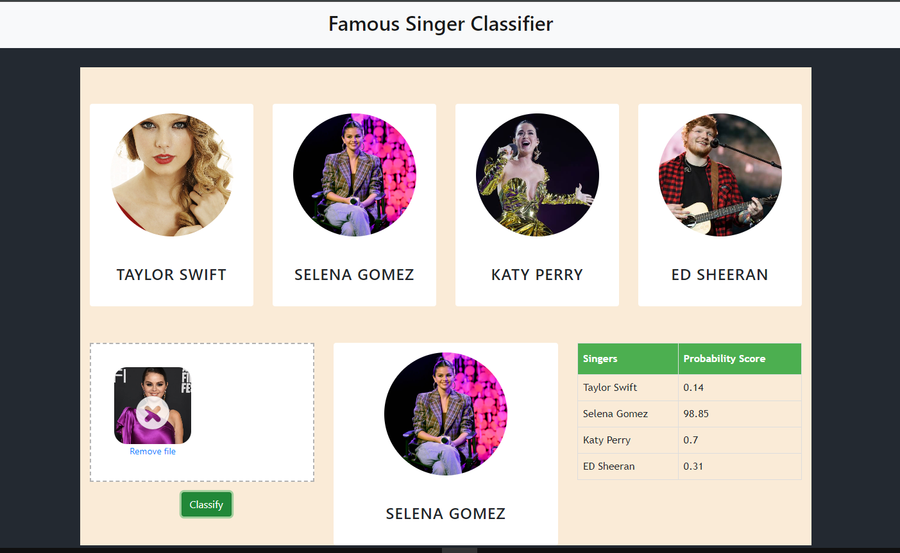

##  Project Summary
  Created a web application that categorizes well-known vocalists using openCV(Haarcascade model) and machine learning. When we upload photos to our website, the application uses these tools to identify the vocalist and provide an accurate probability of their prediction.

#### Technologies used in this project :

<table>
<tr>
  <td><li><b>Programming </b></li></td>
  <td>Python</td>
</tr>
<tr>
  <td><li><b>Visualization </b></li></td>
  <td>Matplotlib & Seaborn</td>
</tr>
<tr>
  <td><li><b>Data Cleaning </b></li></td>
  <td>OpenCV & NumPy</td>
</tr>
<tr>
  <td><li><b>ML & Other Tools </b></li></td>
  <td>Sklearn & Python Flask</td>
</tr>
</table>

